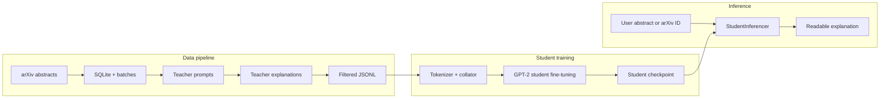

# MiniAstroLM (AstroGPT)
### Distilling astrophysics papers into clear, accessible explanations

MiniAstroLM is a compact, end-to-end teacher–student distillation pipeline that converts arXiv astro-ph abstracts into high-quality, public-friendly explanations.

A large teacher model generates supervision.
A small GPT-2 student is fine-tuned to reproduce it efficiently.

The focus is not scale for its own sake, but faithful explanations, low-cost inference, and full reproducibility.

---

## Why this project exists

Astrophysics papers are precise by design — and inaccessible for general public at large.
Most LLM demos rely on prompting alone, with little control over faithfulness or consistency.

MiniAstroLM takes a systems-first approach:
	•	Supervision over prompting: explanations are generated, filtered, and curated
	•	Distillation over scale: a small student learns the task directly
	•	Realistic constraints: fast inference, cheap training, reproducible runs
	•	Transparent pipeline: every step is inspectable and modifiable


---

## At a glance

```
Raw arXiv abstracts
    -> SQLite ingestion + batching
    -> Teacher-generated explanations
    -> Filtering + validation
    -> Curated JSONL dataset
    -> Student fine-tuning (GPT-2)
    -> Clean, readable explanations
```

---


## Pipeline diagram

```mermaid
flowchart TB
    A[Raw arXiv astro-ph abstracts] --> B[SQLite + batch generation]
    B --> C[Teacher prompt + explanations]
    C --> D[Filtering + JSONL dataset]
    D --> E[Student fine-tuning (GPT-2)]
    E --> F[Readable public-facing explanations]
```

---

## Repo map

```
MiniAstroLM/
├── configs/                  # Training configs (YAML)
├── data/                     # Local data outputs
├── prompts/                  # Teacher prompt templates
├── src/miniastrolm/
│   ├── data_scripts/         # Dataset construction and helpers
│   ├── llm/                  # Teacher interfaces and prompt logic
│   ├── student/              # Student model training and inference
│   ├── training/             # Collators and training utilities
│   └── eval/                 # Evaluation helpers
├── tests/                    # Tests and smoke checks
├── Notebooks/                # Experiments and debugging
└── README.md
```

---


## System architecture



---

## Quickstart (local)

```
conda env create -f environment.yml
conda activate miniastrolm
```

Train the student model (example):

```
python src/miniastrolm/student/train.py --config configs/student_train.yaml
```

---

## Project status

- Training workflow: implemented and configurable
- Dataset pipeline: implemented via data scripts
- Inference CLI: scaffolding in progress

---

## Author

Pushpita Das
Astrophysicist | Machine Learning Researcher | GenAI Systems Developer
