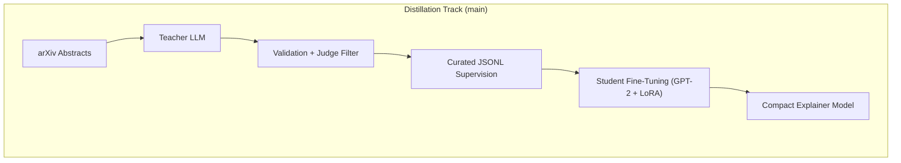
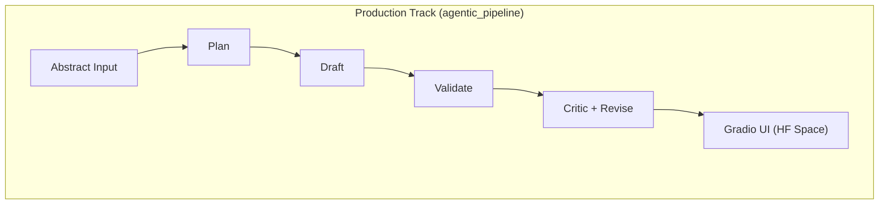

# AstroGPT
### Distillation + Agentic Pipelines for Astrophysics Explanation Generation

AstroGPT is an experiment in building **reliable explanations of astrophysics abstracts**.

Instead of treating this as generic summarization, the project treats explanation as a **controlled generation problem**. The system combines two complementary approaches:

- **Distillation:** train compact language models to reproduce high-quality explanation style
- **Agentic generation:** staged reasoning pipelines that expose intermediate steps

The goal is simple:

> Generate explanations that are understandable to non-experts **without losing scientific grounding.**

---

## Live Demo

Try the deployed version:

🔭 **Hugging Face Space:**  
[](https://huggingface.co/spaces/pudas96/AstroGPT)

The interface lets users:

- browse astronomy abstracts
- read simplified explanations
- inspect the generation trace (plan -> draft -> critic)
- explore glossary terms extracted from the abstracts

---

## Why This Project Exists

Scientific papers are often difficult for non-specialists to understand. Large language models can help, but uncontrolled summarization often produces **hallucinations or shallow explanations**.

This project explores whether combining:

- **controlled supervision (distillation)**
- **inspectable generation pipelines (agentic workflows)**

can produce explanations that remain both **readable and scientifically grounded**.

---

## System Overview

The system starts from raw astrophysics abstracts and gradually builds a reliable explanation pipeline.

1. Abstracts are ingested and cleaned.
2. A teacher model generates candidate explanations.
3. A judge model filters and scores outputs.
4. Accepted samples form a curated training dataset.
5. A compact student model is trained on the filtered supervision.

Alongside this training pipeline, an **agentic inference system** produces explanations in stages:  
plan -> draft -> validate -> critic -> revise

The full generation trace is exposed in the UI for transparency.

---

## Architecture

```text
Astrophysics abstracts
-> Data cleaning + storage
-> Teacher generation under strict prompt constraints
-> Judge scoring + acceptance filtering
-> Curated supervision dataset
-> Student fine-tuning (compact LM)
-> Fast inference

Parallel production track:
-> Agentic staged generation
-> Validation + critique loop
-> Gradio app
-> Hugging Face Space deployment
```


```mermaid
flowchart LR
  subgraph D["Distillation Track (main)"]
    direction LR

    A["arXiv Abstracts"] --> B["Teacher LLM"]
    C["Validation + Judge Filter"] --> E["Curated JSONL Supervision"]
    F["Student Fine-Tuning (GPT-2 + LoRA)"] --> G["Compact Explainer Model"]

    B --> C
    E --> F

    A ~~~ C ~~~ F
    B ~~~ E ~~~ G
  end
```

```mermaid
flowchart LR
  subgraph P["Production Track (agentic_pipeline)"]
    direction LR

    X["Abstract Input"] --> Y["Plan"]
    Z["Draft"] --> U["Validate"]
    V["Critic + Revise"] --> W["Gradio UI (HF Space)"]

    Y --> Z
    U --> V

    X ~~~ Z ~~~ V
    Y ~~~ U ~~~ W
  end
```

## Repository Structure

```text
AstroGPT/
├── src/miniastrolm/
│   ├── data_scripts/        # ingestion, cleaning, dataset shaping
│   ├── llm/                 # teacher + validation/regeneration
│   ├── eval/                # judge schema + evaluation utilities
│   ├── training/            # student training loop
│   └── student/             # inference pipeline
├── prompts/
│   ├── teacher/
│   └── judge/
├── data/
│   ├── teacher/
│   └── evals/
└── README.md
```

## Project Tracks

This repository contains two connected development tracks.

### Distillation Track (main)

Focuses on training a compact explanation model.

- teacher -> judge -> student distillation pipeline
- curated supervision datasets
- GPT-2 fine-tuning with LoRA
- prefix-masked training

### Agentic Track (agentic_pipeline)

Focuses on deployable generation workflows.

- staged generation (plan -> draft -> critique)
- structured validation
- Gradio interface
- Hugging Face Space deployment

---

## Technical Focus

This project explores several aspects of modern LLM system design.

### LLM Systems

- teacher-judge-student distillation architecture
- agentic multi-stage generation pipelines

### Prompt & Output Control

- structured prompt templates
- schema-constrained JSON outputs
- strict explanation formatting rules
- retry/repair strategies for malformed outputs

### Data Pipelines

- automated arXiv ingestion
- JSONL dataset curation
- SQLite intermediate storage

### Model Training

- GPT-2 fine-tuning
- LoRA / PEFT adaptation
- prefix-masked supervision
- gradient accumulation for limited hardware

### Deployment

- Gradio interface
- Hugging Face Spaces deployment
- GitHub-based CI workflow

---

## Running the App Locally

```bash
pip install -r requirements.txt
python app.py
```

Then open:  
http://localhost:7860

## Author

Pushpita Das

Computational astrophysicist transitioning into Generative AI systems research.

Background in large-scale numerical simulations, HPC, and scientific computing.  
Currently focused on building reliable LLM systems for scientific domains.
