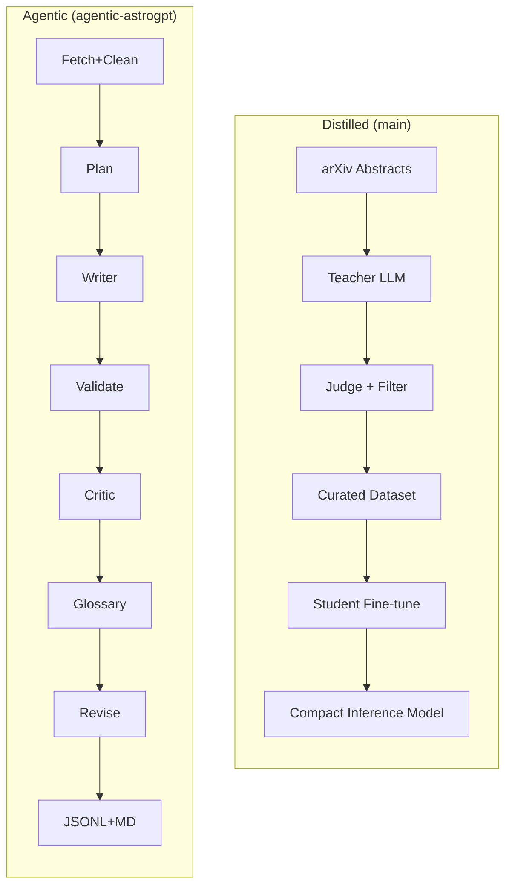
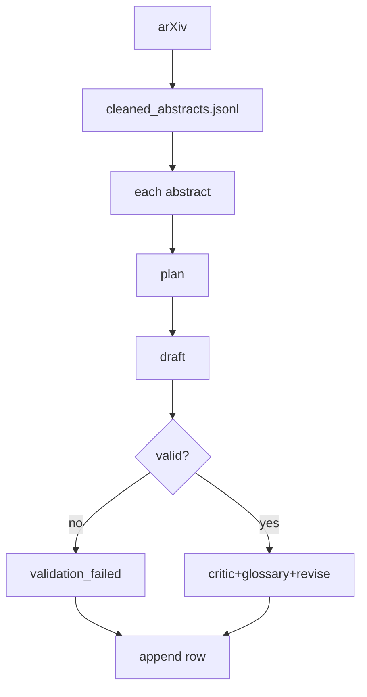

# AstroGPT / MiniAstroLM
### Two LLM Systems in One Repo: Distilled (`main`) + Agentic (`agentic-astrogpt`)

Builds scientific explanations for astrophysics abstracts with two complementary approaches:
- `main`: fine-tuned compact model via controlled distillation
- `agentic-astrogpt`: staged agent pipeline with validation + artifacts

---

## 30-Second Overview

| Branch | What It Is | Why It Matters |
|---|---|---|
| `main` | Teacher -> Judge -> Student (GPT-2 family fine-tune) | Low-cost, repeatable, style-constrained generation |
| `agentic-astrogpt` | Planner -> Writer -> Validator -> Critic -> Reviser | Inspectable reasoning flow with quality gates |

---

## System Schematic (Both Tracks)

### Finetuned Track


```mermaid
flowchart TD
  subgraph A["Distilled (main)"]
    direction TD
    A1["arXiv Abstracts"] --> A2["Teacher LLM"]
    A2 --> A3["Judge + Filter"]
    A3 --> A4["Curated Dataset"]
    A4 --> A5["Student Fine-tune"]
    A5 --> A6["Compact Inference Model"]
  end

  subgraph B["Agentic (agentic-astrogpt)"]
    direction TD
    B1["Fetch+Clean"] --> B2["Plan"]
    B2 --> B3["Writer"]
    B3 --> B4["Validate"]
    B4 --> B5["Critic"]
    B5 --> B6["Glossary"]
    B6 --> B7["Revise"]
    B7 --> B8["JSONL+MD"]
  end
```

---

### Agentic Track


```mermaid
flowchart TD
  I["arXiv"] --> C["cleaned_abstracts.jsonl"]
  C --> R["each abstract"]
  R --> P["plan"]
  P --> W["draft"]
  W --> V{"valid?"}
  V -- "no" --> F["validation_failed"]
  V -- "yes" --> K["critic+glossary+revise"]
  F --> O["append row"]
  K --> O["append row"]
```

Outputs written per run:
- `agent_data/output/agent_runs_YYYYMMDD.jsonl`
- `agent_data/output/agent_runs_YYYYMMDD.md`

---

## Quick Start

### 1) Install
```bash
pip install -r requirements.txt
```

### 2) Run agentic smoke test
```bash
python3 -m src.cli.pipeline --provider mock --max-abstracts 1 --delete-raw
```

### 3) Run with real provider
```bash
python3 -m src.cli.pipeline --provider openai --max-abstracts 5 --delete-raw
```

Provider options: `mock`, `openai`, `hf`, `llama`

---

## Fine-Tuned Track (`main` branch)

```bash
git checkout main
python -m miniastrolm.student.train --config configs/student_train.yaml
python -m miniastrolm.student.infer --config configs/generation.yaml --model_dir data/student/checkpoint --abstract "Abstract text"
```

---

## Recruiter-Facing Skills Demonstrated

- End-to-end LLM system design (data -> supervision -> model -> eval -> artifacts)
- Distillation pipeline engineering with explicit quality filtering
- Multi-stage agent orchestration with tool integration and validation gates
- Production-minded pipeline controls (`--max-abstracts`, `--delete-raw`, append-only outputs)
- Multi-provider inference abstraction (`openai`, `hf`, `llama`, `mock`)

---

## Repo Layout

```text
src/
  agent/      # prompts, orchestration, validators
  cli/        # app + end-to-end pipeline runners
  data/       # arXiv ingest, cleaning, optional SQLite utilities
  llm/        # provider abstraction and adapters
  tools/      # external tools (search)
```

---

## Author

**Pushpita Das**  
Computational Astrophysicist -> Generative AI Systems Research
