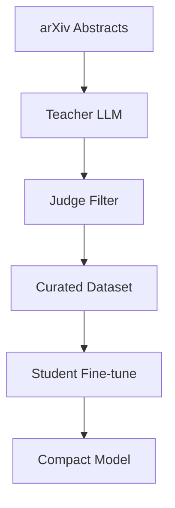
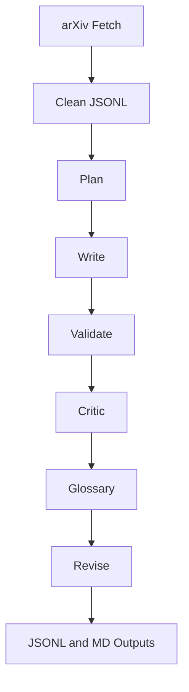

# AstroGPT
### Two LLM Systems in One Repo: Distilled (`main`) + Agentic (`agentic-astrogpt`)

Builds scientific explanations for astrophysics abstracts with two complementary approaches:
- `main`: fine-tuned compact model via controlled distillation
- `agentic-astrogpt`: staged agent pipeline with validation + artifacts

---

## Brief Overview

| Branch | What It Is | Why It Matters |
|---|---|---|
| `main` | Teacher -> Judge -> Student (GPT-2 family fine-tune) | Low-cost, repeatable, style-constrained generation |
| `agentic-astrogpt` | Planner -> Writer -> Validator -> Critic -> Reviser | Inspectable reasoning flow with quality gates |

---

## System Schematics

### Distilled Track (`main`)


```mermaid
flowchart TD
  A["arXiv Abstracts"] --> B["Teacher LLM"]
  B --> C["Judge Filter"]
  C --> D["Curated Dataset"]
  D --> E["Student Fine-tune"]
  E --> F["Compact Model"]
```

---

### Agentic Track (`agentic-astrogpt`)


```mermaid
flowchart TD
  A["arXiv Fetch"] --> B["Clean JSONL"]
  B --> C["Plan"]
  C --> D["Write"]
  D --> E["Validate"]
  E --> F["Critic"]
  F --> G["Glossary"]
  G --> H["Revise"]
  H --> I["JSONL and MD Outputs"]
```

Outputs written per run:
- `agent_data/output/agent_runs_YYYYMMDD.jsonl`
- `agent_data/output/agent_runs_YYYYMMDD.md`

---

## Quick Start

### 1) Install
```bash
pip install -r requirements.txt
```

### 2) Run agentic smoke test
```bash
python3 -m src.cli.pipeline --provider mock --max-abstracts 1 --delete-raw
```

### 3) Run with real provider
```bash
python3 -m src.cli.pipeline --provider openai --max-abstracts 5 --delete-raw
```

Provider options: `mock`, `openai`, `hf`, `llama`

---

## Fine-Tuned Track (`main` branch)

```bash
git checkout main
python -m miniastrolm.student.train --config configs/student_train.yaml
python -m miniastrolm.student.infer --config configs/generation.yaml --model_dir data/student/checkpoint --abstract "Abstract text"
```

---

## Technical Highlights

### 1. Explicit Supervision Construction
Teacher outputs follow a strict JSON schema:

- `id`
- `title`
- `abstract`
- `target_explanation`
- `judge_feedback`
- `accepted`

Only samples meeting scoring thresholds are used for student training.  
This keeps supervision high-signal and reduces style drift before fine-tuning.

### 2. Masked Causal LM Training
Training format:

```text
[prompt tokens] -> masked (-100)
[target tokens] -> supervised
```

The student learns conditional explanation generation without being penalized on prefix tokens.

### 3. Agentic Writing Pipeline with Validation Gates
Implemented a staged generation flow:

`plan -> write -> validate -> critic -> glossary -> revise`

Validation is enforced as an explicit control point (word count, paragraph structure, forbidden phrasing), with a structured `validation_failed` path instead of silent failure.

### 4. Production-Ready Pipeline Controls and Artifacts
- Loop-level agent reuse (single initialization across abstracts)
- Run controls: `--max-abstracts`, `--delete-raw`
- Machine-readable outputs: `agent_runs_YYYYMMDD.jsonl`
- Human-review outputs: `agent_runs_YYYYMMDD.md`

This supports reproducible runs, lightweight ops, and fast debugging.

### 5. Provider-Agnostic LLM Integration
The same pipeline supports multiple backends:

- `mock` (smoke tests)
- `openai`
- `hf`
- `llama`

This enables easy model/backend swapping without changing core orchestration logic.

---

## Repo Layout

```text
src/
  agent/      # prompts, orchestration, validators
  cli/        # app + end-to-end pipeline runners
  data/       # arXiv ingest, cleaning, optional SQLite utilities
  llm/        # provider abstraction and adapters
  tools/      # external tools (search)
```

---

## Author

**Pushpita Das**  
Computational Astrophysicist -> Generative AI Systems Research
